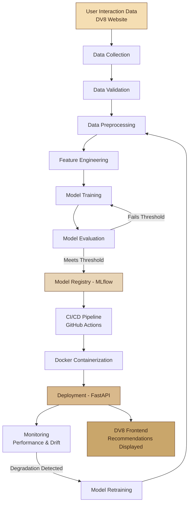

DV8 Coffee Shop — MLOps Assignment
Git Branching Strategy

This project follows a structured Git branching strategy to maintain stable production code while allowing development and feature work to happen independently.

Branch Structure
main
  │
  └── dev
       │
       └── feature/mlops-documentation
Branch	Purpose
main	Stable production/submission version of the project
dev	Development and integration branch
feature/*	Individual features, improvements, and assignment work
Development Workflow

The recommended workflow for this project is:

feature branch
      │
      │ Pull Request
      ▼
     dev
      │
      │ Pull Request
      ▼
    main

Changes should be developed on a feature branch rather than directly on main.

For example:

git checkout dev
git checkout -b feature/mlops-documentation

# Make changes

git add .
git commit -m "Add MLOps lifecycle documentation"
git push -u origin feature/mlops-documentation

After completing the feature, a Pull Request should be created from:

feature/mlops-documentation → dev

Once the changes have been tested and approved in dev, they can be promoted to:

dev → main

This approach keeps main stable while allowing multiple features to be developed independently.

MLOps Lifecycle

This project demonstrates an MLOps lifecycle using a proposed product recommendation system for the DV8 Coffee Shop eCommerce application.

The lifecycle covers:

Data Collection
      ↓
Data Validation
      ↓
Data Preprocessing
      ↓
Feature Engineering
      ↓
Model Training
      ↓
Model Evaluation
      ↓
Model Registry
      ↓
CI/CD
      ↓
Docker
      ↓
Deployment
      ↓
Monitoring
      ↓
Model Retraining
      ↺

The complete lifecycle documentation is provided below.

Project Objective

The proposed machine learning feature is a Product Recommendation System for DV8.

The system would analyze user interactions such as:

Product views
Searches
Add-to-cart actions
Purchases
User preferences
Product characteristics

The objective is to provide personalized coffee recommendations and improve user engagement and conversion.

MLOps Technology Stack
Component	Technology
Frontend	HTML, CSS, JavaScript
Data Processing	Python, Pandas
Machine Learning	Scikit-learn
Experiment Tracking	MLflow
Model Registry	MLflow
API / Model Serving	FastAPI
Containerization	Docker
CI/CD	GitHub Actions
Monitoring	Prometheus, Grafana, Evidently AI
Assignment Deliverables

This repository demonstrates:

Git repository initialization and remote repository management
main, dev, and feature branch strategy
Feature-based development workflow
Pull Request based integration
MLOps lifecycle documentation
Data collection and validation
Data preprocessing and feature engineering
Machine learning model training
Model evaluation
Model versioning and registry
CI/CD automation
Docker containerization
Model deployment
Production monitoring
Automated model retraining
Conclusion

The project combines a structured Git branching strategy with an end-to-end MLOps lifecycle.

The branching strategy provides controlled software development through:

Feature → Development → Main

while the MLOps workflow provides controlled machine learning development through:

Data → Training → Evaluation → Deployment → Monitoring → Retraining

Together, these practices demonstrate how modern software engineering and machine learning operations can be integrated into a reproducible and maintainable development workflow.

# DV8 Coffee Shop — MLOps Workflow Documentation

### Proposed Product Recommendation System — MLOps Integration Plan

---

## 1. Introduction

**DV8** is a modern eCommerce coffee shop web application built using **HTML, CSS, and JavaScript**. It offers a clean, responsive user interface, interactive product listings, a fully functional shopping cart, user authentication pages, and smooth client-side navigation.

The purpose of this document is to serve as an MLOps assignment deliverable, demonstrating a complete, production-grade machine learning pipeline — from raw data collection to continuous monitoring and retraining — mapped conceptually onto the DV8 project.

---

## 2. Proposed ML Feature: Product Recommendation System

The proposed feature is a **Product Recommendation System** designed to suggest coffee products to users based on their browsing behavior, purchase history, and interaction patterns (clicks, cart additions, time spent on product pages, etc.).

**Goal:** Increase user engagement and conversion rate by surfacing relevant coffee products (e.g., "customers who bought Ethiopian Light Roast also liked Colombian Medium Roast") directly within the DV8 storefront.

This would be implemented as a **separate backend microservice** that integrates with the existing HTML/CSS/JS frontend via a lightweight REST API, without disrupting the current client-side architecture.

---

## 3. MLOps Pipeline — Flow Diagram

The diagram below illustrates the complete proposed MLOps lifecycle, from raw user data to a continuously monitored and retrained recommendation model in production.



---

## 4. Pipeline Stages — Detailed Breakdown

### 4.1 Data Collection

- User interaction events would be captured from the DV8 frontend: **product views, add-to-cart actions, wishlist additions, search queries, and completed purchases**.
- Data would be logged via lightweight JavaScript event tracking (e.g., `fetch()` calls to a logging endpoint) and stored in a structured database (PostgreSQL) or event stream (Kafka) for scalability.
- Additional data sources would include the existing product catalog (name, category, roast type, price, origin) and user profile metadata from the authentication system.

### 4.2 Data Validation

- Before entering the pipeline, raw data would be validated for **schema consistency, missing values, duplicate events, and outliers** (e.g., impossible timestamps or negative prices).
- Tools such as **Great Expectations** or custom **Pandas**-based validation scripts would enforce data quality gates.
- Invalid or incomplete records would be quarantined and logged for manual review rather than silently dropped.

### 4.3 Data Preprocessing

- Raw interaction logs would be cleaned, deduplicated, and transformed into a structured format suitable for modeling.
- Categorical fields (roast type, origin, category) would be encoded; timestamps would be normalized into session-based windows.
- User-item interaction matrices would be constructed, forming the foundation for collaborative filtering approaches.

### 4.4 Feature Engineering

- Derived features would include:
  - **User-level features:** purchase frequency, average order value, favorite category, recency of last visit.
  - **Item-level features:** popularity score, category embeddings, price bucket, roast strength.
  - **Interaction features:** implicit ratings derived from view/cart/purchase weighting.
- Feature transformations would be built using **Scikit-learn** pipelines (`Pipeline`, `ColumnTransformer`) to ensure reproducibility between training and inference.

### 4.5 Model Training

- The recommendation model would be trained using a **hybrid approach**:
  - **Collaborative Filtering** (matrix factorization, e.g., ALS or SVD) for users with sufficient history.
  - **Content-Based Filtering** (cosine similarity on product features) for cold-start users/products.
- Training would be conducted in Python using **Scikit-learn** (and optionally **Surprise** or **implicit** libraries for collaborative filtering).
- Experiments would be tracked with **MLflow**, logging hyperparameters, metrics, and artifacts for every run.

### 4.6 Model Evaluation

- Model performance would be assessed using standard recommendation metrics:

| Metric | Purpose |
|---|---|
| Precision@K | Relevance of top-K recommendations |
| Recall@K | Coverage of relevant items retrieved |
| NDCG | Ranking quality of recommendations |
| RMSE / MAE | Rating prediction accuracy (if explicit ratings used) |

- A minimum threshold (e.g., Precision@5 ≥ 0.25) would gate promotion to the registry — models failing this threshold would be sent back for retraining or feature refinement.

### 4.7 Model Registry (MLflow)

- Validated models would be registered in the **MLflow Model Registry**, versioned, and tagged (`staging`, `production`, `archived`).
- The registry would store model artifacts, associated metrics, and lineage information (which dataset and code version produced the model), enabling full reproducibility and rollback capability.

### 4.8 CI/CD Pipeline

- **GitHub Actions** would automate the pipeline:
  - On code push: run unit tests, data validation checks, and linting.
  - On merge to `main`: trigger model retraining, evaluation, and, if passing thresholds, automatic promotion in MLflow.
  - On model promotion: trigger the build-and-deploy workflow.

```yaml
# Example: .github/workflows/mlops-pipeline.yml (conceptual)
name: MLOps Pipeline
on:
  push:
    branches: [main]

jobs:
  train-and-validate:
    runs-on: ubuntu-latest
    steps:
      - uses: actions/checkout@v4
      - name: Set up Python
        uses: actions/setup-python@v5
        with:
          python-version: "3.11"
      - name: Install dependencies
        run: pip install -r requirements.txt
      - name: Run data validation
        run: python src/validate_data.py
      - name: Train model
        run: python src/train.py
      - name: Evaluate model
        run: python src/evaluate.py
      - name: Log to MLflow
        run: python src/register_model.py
```

### 4.9 Docker Containerization

- The trained model and inference logic would be packaged into a lightweight **Docker** image, ensuring consistent behavior across development, staging, and production environments.

```dockerfile
# Example: Dockerfile (conceptual)
FROM python:3.11-slim

WORKDIR /app
COPY requirements.txt .
RUN pip install --no-cache-dir -r requirements.txt

COPY ./app ./app
COPY ./models ./models

EXPOSE 8000
CMD ["uvicorn", "app.main:app", "--host", "0.0.0.0", "--port", "8000"]
```

### 4.10 Deployment using FastAPI

- The registered model would be served through a **FastAPI** microservice exposing a REST endpoint (e.g., `GET /recommendations/{user_id}`).
- The DV8 frontend (JavaScript) would call this endpoint asynchronously to fetch personalized recommendations and render them on product/cart pages.

```python
# Example: app/main.py (conceptual)
from fastapi import FastAPI
import mlflow.pyfunc

app = FastAPI(title="DV8 Recommendation Service")
model = mlflow.pyfunc.load_model("models:/dv8-recommender/production")

@app.get("/recommendations/{user_id}")
def get_recommendations(user_id: str, top_k: int = 5):
    recommendations = model.predict({"user_id": user_id, "top_k": top_k})
    return {"user_id": user_id, "recommendations": recommendations}
```

### 4.11 Monitoring

- Post-deployment, the system would track:
  - **Prediction latency and API uptime**
  - **Data drift** (shifts in user behavior or product catalog distribution)
  - **Model performance decay** (click-through rate on recommendations over time)
- Tools such as **Prometheus + Grafana** or **Evidently AI** would be used to visualize drift and trigger alerts.

### 4.12 Model Retraining

- Retraining would be triggered either **on a schedule** (e.g., weekly) or **automatically** when monitoring detects significant performance degradation or data drift.
- The retraining job would re-enter the pipeline at the **Data Preprocessing** stage, ensuring the model continuously adapts to evolving user preferences and new product listings.

---

## 5. Technology Stack

| Layer | Technology |
|---|---|
| Frontend | HTML, CSS, JavaScript |
| Data Processing | Python, Pandas |
| Machine Learning | Scikit-learn |
| Experiment Tracking & Registry | MLflow |
| Model Serving | FastAPI |
| Containerization | Docker |
| CI/CD Automation | GitHub Actions |

---

## 6. Expected Outcome & Benefits

Integrating this proposed MLOps-driven recommendation system into DV8 is expected to deliver the following benefits:

- **Personalized Shopping Experience** — Users see coffee products tailored to their taste and browsing history, improving engagement.
- **Increased Conversion Rate** — Relevant recommendations at the cart and product pages would drive higher average order value.
- **Reproducible & Auditable ML Lifecycle** — Every model version is tracked, tested, and traceable via MLflow and CI/CD logs.
- **Scalable Deployment** — Docker + FastAPI ensures the recommendation service can scale independently of the main website.
- **Continuous Improvement** — Automated monitoring and retraining keep the model accurate as user behavior and the product catalog evolve.
- **Clean Separation of Concerns** — The ML service operates as an independent microservice, requiring no structural changes to DV8's existing HTML/CSS/JS frontend.

---

## 7. Conclusion

This document outlines a **proposed, end-to-end MLOps workflow** for adding a Product Recommendation System to the DV8 coffee shop platform. It does not reflect an already-implemented feature; rather, it demonstrates the complete engineering discipline — data collection through retraining — required to responsibly design, deploy, and maintain a machine learning system within a real-world web application.

---
